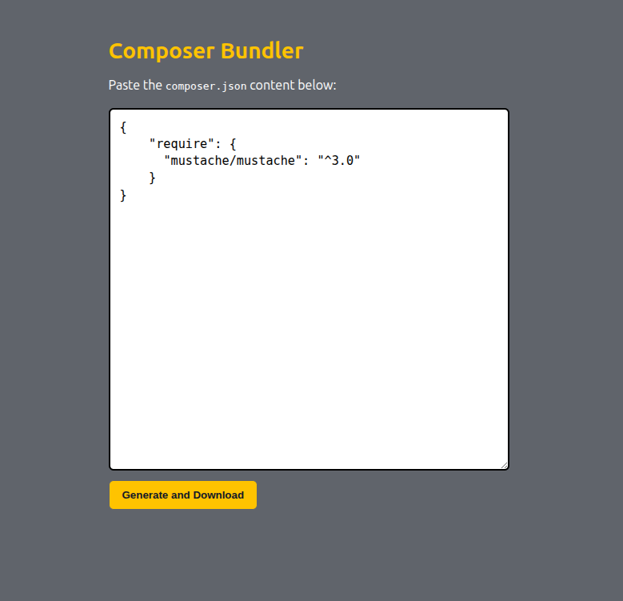
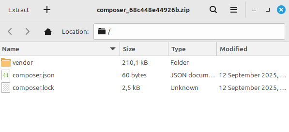

# Composer Bundler

**Composer Bundler** is a lightweight PHP web application that allows you to generate and download `vendor/` bundles from a `composer.json` file without requiring Composer CLI on your local machine.  

This is especially useful for users who cannot install Composer locally but still need to build and ship dependencies.


## ✨ Features
- Paste your `composer.json` in the web UI
- Automatically runs `composer install` on the server
- Packages the `vendor/` directory into a ZIP file
- Download-ready bundle with autoload support
- Easy to self-host:
  - Works on any Linux/macOS machine with PHP installed
  - Can be run using the built-in PHP development server or deployed on Apache/Nginx


## ⚠️ Requirements

- **PHP 8.1+**  
- **Composer** installed on the server (used by the app to generate vendor bundles)  
- Linux, macOS, or any system where `shell_exec()` can run Composer commands  


## 🚀 Installation

1. Clone this repository:

   ```bash
   git clone https://github.com/rmnsr/composer-bundler.git
   cd composer-bundler

2. Install the dependencies
   
   ```bash
   composer install

3. Run the PHP dev server
   ```bash
   php -S localhost:8000 -t html

Open http://localhost:8000
 in your browser.

## Screenshot

Interface:




Downloaded ZIP example:

